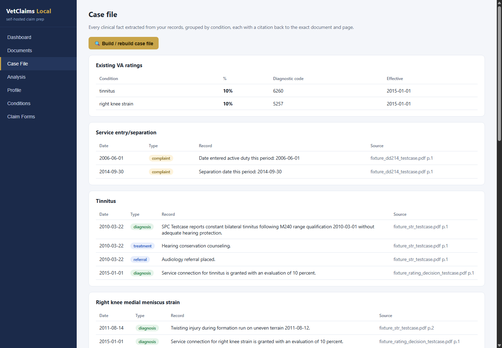
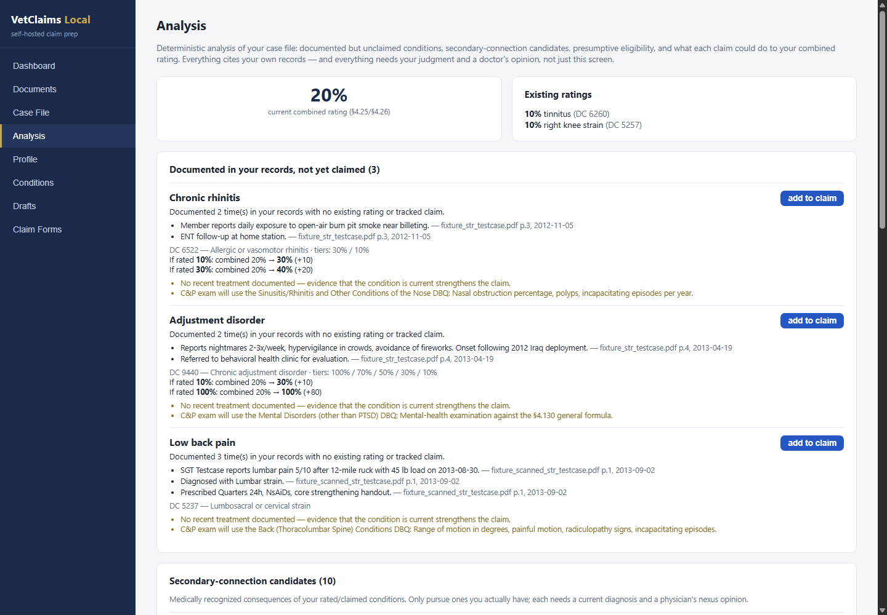
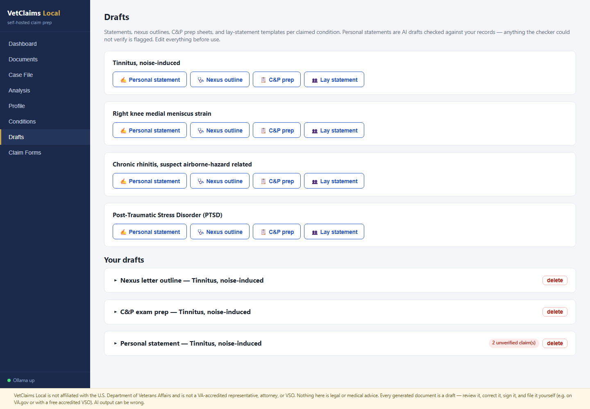

# VetClaims Local

**Self-hosted, fully-local VA disability claim preparation.** Upload your
service and medical records, let a local LLM (via [Ollama](https://ollama.com))
analyze them, and walk away with a complete, ready-to-file VA claim packet —
filled **21-526EZ**, personal statements on **21-4138**, Intent to File on
**21-0966**, an indexed evidence PDF built from your own records, and (when a
decision comes back) drafted **20-0995/20-0996** appeal forms. Your records
never leave your machine.

> ⚠️ **Disclaimers — read these.**
> VetClaims Local is **not** affiliated with the U.S. Department of Veterans
> Affairs. It is **not** a VA-accredited agent, attorney, or Veterans Service
> Organization, and it does **not** file claims on your behalf. Nothing it
> produces is legal or medical advice. Every generated document is a **draft**
> that you must review, correct, sign, and submit yourself (e.g., via
> [VA.gov](https://www.va.gov) or a free accredited VSO — DAV, VFW, American
> Legion, county service officers). AI output can be wrong; you are
> responsible for anything you file.

## Why self-hosted?

Commercial claim-prep services charge four figures and ask you to upload
decades of PII/PHI to their cloud. This runs entirely on your own hardware:
local LLM inference, local OCR, SQLite on disk, zero telemetry, zero runtime
network calls (Ollama on `localhost` is the only out-of-process dependency).

## What it does

1. **Ingest** — drop in your DD-214, service treatment records, VA rating
   decisions, private records. Native text is extracted; scanned pages are
   OCR'd offline (RapidOCR). Every document is auto-classified and embedded
   for semantic search.
2. **Case file** — a local LLM extracts every diagnosis, complaint, injury,
   treatment, and exposure into a timeline, each fact citing the exact
   document and page it came from.
3. **Analyze** — deterministic engine (no LLM, auditable) finds documented
   conditions you haven't claimed, medically recognized secondary conditions,
   and presumptive eligibility (PACT Act, Agent Orange, Gulf War, Camp
   Lejeune) — with real 38 CFR §4.25/§4.26 combined-rating math showing the
   what-if impact of each claim, against the actual rating schedule pulled
   from the eCFR (724 diagnostic codes).
4. **Draft** — personal statements built strictly from your cited records and
   run through a grounding checker that flags any sentence it can't verify;
   plus nexus-letter outlines for your physician, C&P exam prep sheets with
   the real rating criteria, and lay-statement templates.
5. **Publish** — one ZIP in filing order: checklist cover sheet, 21-0966,
   21-526EZ (identity, service, exposures, and conditions filled onto the
   official form), each statement as a 21-4138, and an exhibit-stamped
   evidence PDF with a per-condition index.
6. **Appeal** — parse the VA's decision letter, see per-issue outcomes and
   denial reasons, get an AMA-lane recommendation with deadlines, and generate
   the filled 20-0995/20-0996 plus a grounded rebuttal statement.

## Screenshots

*All data shown is a fictional test fixture ("Alexandra Testcase") — never a
real person.*

| The workflow | |
|---|---|
|  |  |
| Case file: every fact cited to a document and page | Analysis: suggestions, what-if ratings, evidence gaps |
|  |  |
| Conditions selected for the claim | Grounding-checked statement drafts |

| The output — real VA forms, filled | |
|---|---|
|  |  |
| 21-526EZ Section V from your selected conditions | 21-4138 with identity block and statement |

## Requirements

- A machine with an NVIDIA GPU (16 GB VRAM recommended — e.g. RTX 4090; the
  default model set fits fully in VRAM)
- [Ollama](https://ollama.com) · Python 3.12+ · Node 20+
- Models: `mistral-small:22b` (primary), `qwen3:4b` (fast lane),
  `nomic-embed-text` (embeddings) — pulled by the setup script. Swap any of
  them via `VETCLAIMS_MODEL_*` env vars.

## Quick start

```bash
git clone https://github.com/danielneustadter/vetclaims-local
cd vetclaims-local
# Windows:  powershell -ExecutionPolicy Bypass -File scripts\setup.ps1
# Linux/macOS:  bash scripts/setup.sh

# terminal 1
cd backend && .venv/Scripts/uvicorn app.main:app --port 8600
# terminal 2
cd frontend && npm run dev     # open http://localhost:5173
```

Or with Docker (Ollama stays on the host for GPU access): `docker compose up
--build`.

## Security

- Optional passphrase lock (PBKDF2, set from the Dashboard).
- One-click full backup ZIP of your `data/` directory.
- At-rest encryption is delegated to the OS — turn on BitLocker / FileVault /
  LUKS. Your data never leaves `data/` (gitignored).

## Architecture & development

BMAD-method project docs live in [docs/](docs/): [PRD](docs/prd.md),
[architecture](docs/architecture.md), [epic board](docs/epics/README.md).
FastAPI + SQLite (+sqlite-vec) backend, React/Vite frontend, single in-process
job queue, schema-constrained JSON for every extraction call. Tests:
`cd backend && pytest` (set `VETCLAIMS_LLM_TESTS=1` for live-LLM recall tests).

Reference data is rebuilt with `python scripts/build_rating_schedule.py`
(38 CFR Part 4 via the eCFR API); curated datasets (secondary-condition graph,
presumptives, DBQ map) are in `backend/app/refdata/data/`.

## License

MIT — see [LICENSE](LICENSE). Official VA form templates are US Government
works (public domain).
