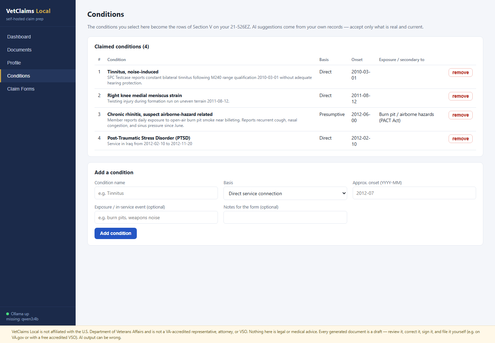
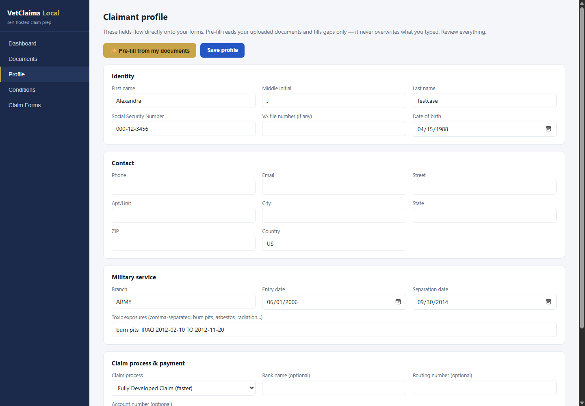
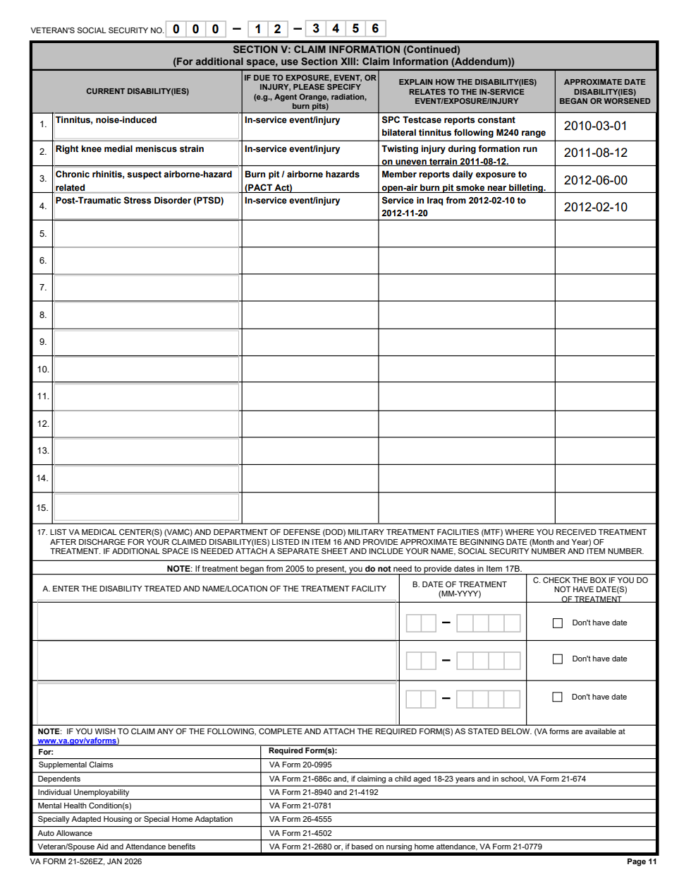
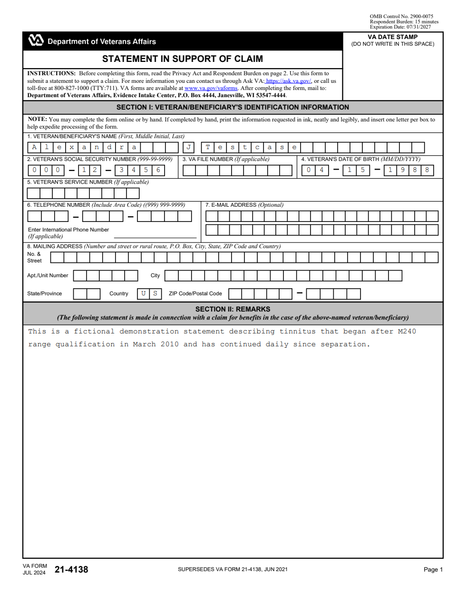

# VetClaims Local

**Self-hosted, fully-local VA disability claim preparation.** Upload your service
and medical records, let a local LLM (via [Ollama](https://ollama.com)) analyze
them, and walk away with a complete, filled, ready-to-file VA claim packet —
21-526EZ, personal statements on 21-4138, Intent to File on 21-0966, and an
indexed evidence PDF. Your records never leave your machine.

> ⚠️ **Disclaimers — read these.**
> VetClaims Local is **not** affiliated with the U.S. Department of Veterans
> Affairs. It is **not** a VA-accredited agent, attorney, or Veterans Service
> Organization, and it does **not** file claims on your behalf. Nothing it
> produces is legal or medical advice. Every generated document is a **draft**
> that you must review, correct, and submit yourself (e.g., via
> [VA.gov](https://www.va.gov) or a free accredited VSO). AI output can be
> wrong; you are responsible for the accuracy of anything you file.

## Why self-hosted?

Commercial claim-prep services ask you to upload decades of medical records to
their cloud. This runs entirely on your own hardware: local LLM inference
(Ollama), local OCR, SQLite on disk, zero telemetry, zero external calls at
runtime.

## Status

🚧 Under active development — the **walking skeleton is working end-to-end**:
upload records → local LLM pre-fills your profile and suggests conditions with
evidence notes → you review/edit everything → download the filled 21-526EZ,
21-4138, and 21-0966. See [docs/prd.md](docs/prd.md),
[docs/architecture.md](docs/architecture.md), and the
[epic board](docs/epics/README.md).

## Screenshots

*All shown data is a fictional test fixture ("Alexandra Testcase"), never a
real person.*

| | |
|---|---|
|  |  |
| AI-suggested conditions with evidence notes from your own records | Profile pre-filled by the local LLM, human-editable |

**The output — real VA forms, filled:**

| | |
|---|---|
|  |  |
| 21-526EZ Section V built from your selected conditions | 21-4138 statement with identity block |

## Requirements

- Windows / Linux / macOS with an NVIDIA GPU (16 GB VRAM recommended)
- [Ollama](https://ollama.com) with a mid-size instruct model (default:
  `mistral-small:22b`) and `nomic-embed-text`
- Python 3.12+, Node 20+

## Quick start (dev)

```bash
# backend
cd backend
python -m venv .venv && .venv/Scripts/pip install -r requirements.txt
.venv/Scripts/uvicorn app.main:app --reload --port 8600

# frontend
cd frontend
npm install && npm run dev
```

## License

MIT — see [LICENSE](LICENSE).
